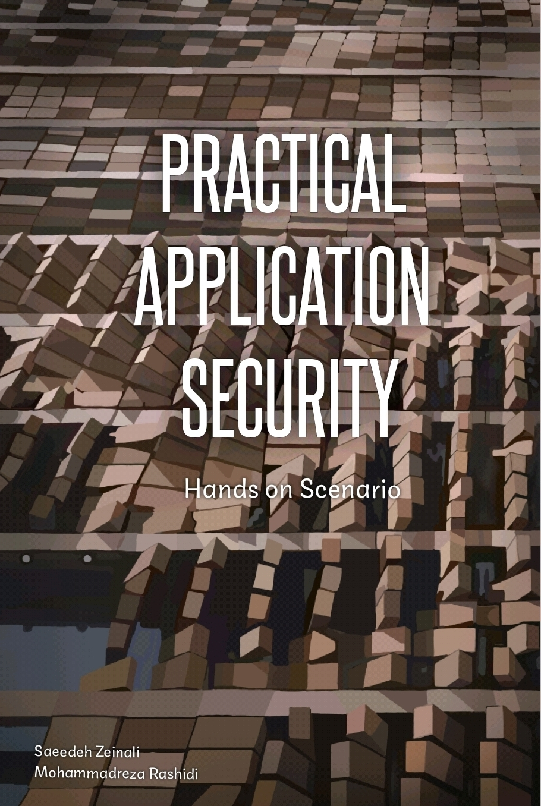

# Ресурсы

{: .no_toc }

## Оглавление
{: .no_toc .text-delta }

1. TOC
{:toc}

---

## Книги

### Hands-On Security in DevOps

[Hands-On Security in DevOps](https://www.amazon.com/Hands-Security-DevOps-continuous-deployment/dp/1788995503){: .btn .btn-purple .mr-2 }

### Практическая разведка угроз и охота за угрозами на основе данных: Практическое руководство по поиску угроз с помощью ATT&CK™ Framework и инструментов с открытым исходным кодом

Ознакомьтесь с информацией о киберугрозах и поиске угроз на основе данных, изучите советы и методики экспертов.

[Practical Threat Intelligence and Data-Driven Threat Hunting](https://www.amazon.com/Practical-Threat-Hunting/dp/1838556370){: .btn .btn-purple .mr-2 }

### Operationalizing Threat Intelligence: Руководство по разработке и введению в действие программ разведки киберугроз

Изучите основы разведки киберугроз, чтобы внедрить и ввести в действие программу организационной разведки

[Operationalizing Threat Intelligence](https://www.amazon.com/Operationalizing-Threat-Intelligence-operationalizing-intelligence/dp/1801814686){: .btn .btn-purple .mr-2 }

### Безопасность веб-приложений: Эксплуатация и контрмеры для современных веб-приложений

В то время как существует множество ресурсов по сетевой и ИТ-безопасности, подробных знаний о современной безопасности веб-приложений не хватало - до сих пор. В этом практическом руководстве представлены как наступательные, так и оборонительные концепции безопасности, которые могут легко освоить и применить инженеры-программисты.

[Web Application Security: Exploitation and Countermeasures for Modern Web Applications](https://www.amazon.com/Web-Application-Security-Exploitation-Countermeasures/dp/1492053112){: .btn .btn-purple .mr-2 }

### Практическое применение Безопасность

Книга о более +15 типах уязвимостей, их атаке и защите, а также учебник о программных средствах защиты и устройствах.

[Practical Application Security](https://leanpub.com/practicalappsec){: .btn .btn-purple .mr-2 }

## Руководящие принципы

### OWASP DevSecOps Guidelines

OWASP DevSecOps Guideline объясняет, как реализовать безопасный пайплайн и использовать лучшие практики, а также представляет инструменты, которые можно использовать в этом вопросе. Кроме того, проект пытается помочь нам продвинуть культуру безопасности "сдвиг влево" в процессе разработки. Этот проект поможет компаниям любого размера, у которых есть пайплайн разработки или, другими словами, пайплайн DevOps. В ходе проекта мы попытаемся нарисовать перспективу безопасного пайплайна DevOps, а затем усовершенствовать его в соответствии с нашими индивидуальными требованиями.

[OWASP DevSecOps Guideline](https://owasp.org/www-project-devsecops-guideline/latest/){: .btn .btn-purple .mr-2 }

### 6mile DevSecOps Playbook

Этот учебник поможет вам внедрить эффективные практики DevSecOps в вашей компании, независимо от ее размера. Мы предоставляем четкое руководство и практические шаги по внедрению средств контроля безопасности, измерению их эффективности и демонстрации соотношения цены и качества руководителям вашего бизнеса. Следование этому руководству поможет командам создавать существенно более безопасные приложения, что, в конечном счете, и является целью.

[6mile DevSecOps Playbook](https://github.com/6mile/DevSecOps-Playbook){: .btn .btn-purple .mr-2 }

### Aif4thah Dojo-101

База знаний в области кибербезопасности, администрирования и безопасной разработки

[Aif4thah Dojo-101](https://github.com/Aif4thah/Dojo-101){: .btn .btn-purple .mr-2 }

### sottlmarek DevSecOps

[sottlmarek DevSecOps](https://github.com/sottlmarek/DevSecOps){: .btn .btn-purple .mr-2 }

### AcalephStorage Awesome DevSecOps

[AcalephStorage Awesome DevSecOps](https://github.com/AcalephStorage/awesome-devops){: .btn .btn-purple .mr-2 }

### wmariuss Awesome DevOps

[wmariuss Awesome DevOps](
https://github.com/wmariuss/awesome-devops#api-gateway){: .btn .btn-purple .mr-2 }

### zoidbergwill Awesome eBPF

[zoidbergwill Awesome eBPF](
https://github.com/zoidbergwill/awesome-ebpf){: .btn .btn-purple .mr-2 }

## Framework

### Концепция внедрения облачных технологий

Проверенное руководство и лучшие практики, которые помогут вам уверенно внедрить облако и достичь бизнес-результатов.

[Microsoft Cloud Adoption Framework](https://learn.microsoft.com/en-us/azure/cloud-adoption-framework/){: .btn .btn-purple .mr-2 }

## Шпаргалка

Привет! Меня зовут Ларс Виндольф, и я специализируюсь на системной архитектуре и DevSecOps. Я очень забочусь о сборе и распространении знаний и использую этот сайт в качестве ресурса для своей повседневной работы.

[lzone](https://lzone.de/cheat-sheet/Container){: .btn .btn-purple .mr-2 }

## Лаборатория

### Эмуляция противника в облаке

Проверенное руководство и лучшие практики, которые помогут вам уверенно внедрить "облако" и достичь бизнес-результатов.

[Granular, Actionable Adversary Emulation for the Cloud](https://github.com/Datadog/stratus-red-team/){: .btn .btn-purple .mr-2 }

### Моделирование и обнаружение угроз AWS

[sbasu7241 AWS Threat Simulation and Detection ](https://github.com/sbasu7241/AWS-Threat-Simulation-and-Detection/tree/main){: .btn .btn-purple .mr-2 }

### Охотничьи запросы и обнаружения

[FalconForceTeam FalconFriday](https://github.com/FalconForceTeam/FalconFriday/){: .btn .btn-purple .mr-2 }

## Угрозы

### Облако

[MITRE ATT&CK Cloud](https://attack.mitre.org/matrices/enterprise/cloud/){: .btn .btn-purple .mr-2 }

### DevOps

[DevOps Threat Matrix](https://www.microsoft.com/en-us/security/blog/2023/04/06/devops-threat-matrix/){: .btn .btn-purple .mr-2 }

[Kubernetes Threat Matrix](https://www.microsoft.com/en-us/security/blog/2020/04/02/attack-matrix-kubernetes/){: .btn .btn-purple .mr-2 }

